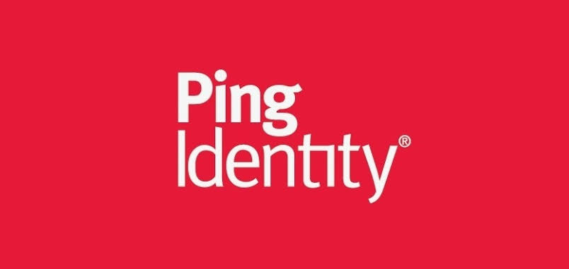
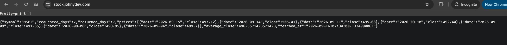
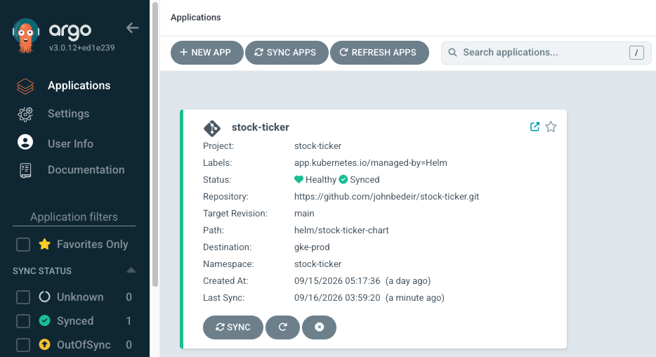
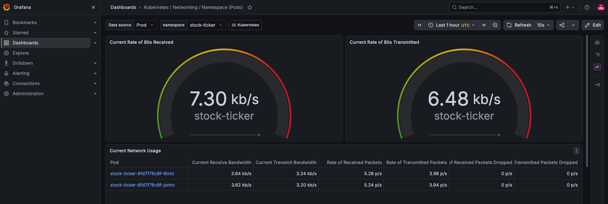
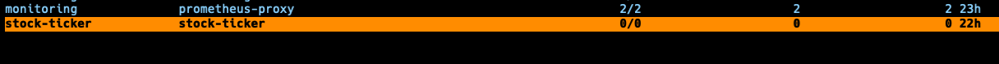
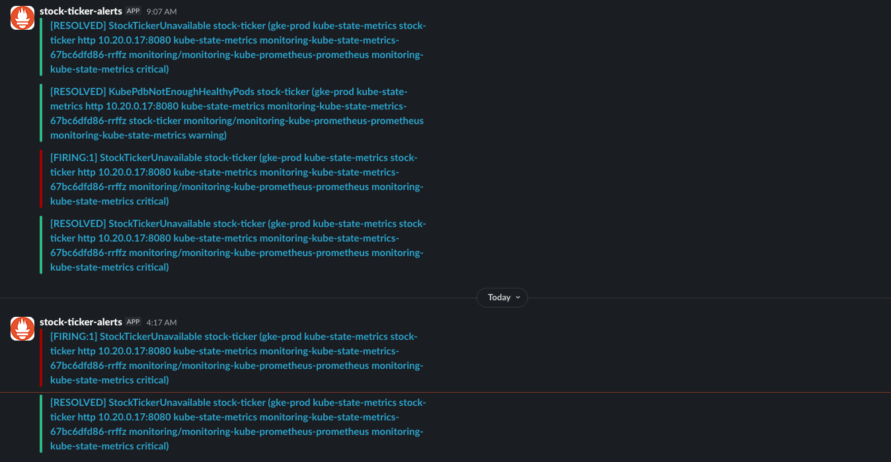
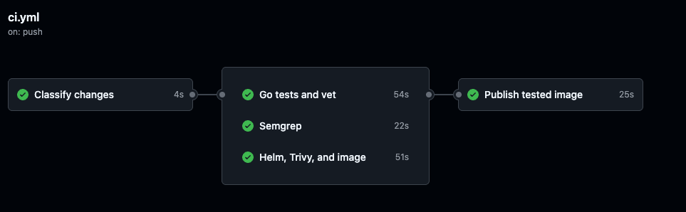

# Stock Ticker

  

Go service that returns recent stock closing prices and their average. The
application can run locally, in Docker, in Minikube, or on GKE through Argo CD.

Production: <https://stock.johnydev.com/>
Repository: <https://github.com/johnbedeir/stock-ticker>

## Reviewer quick start

1. Check the live service: `curl https://stock.johnydev.com/`
2. Pull the public image: `docker pull us-east1-docker.pkg.dev/johnydev/stock-ticker/stock-ticker:v1.0.0`
3. Run local tests: `cd app && go test -race ./... && go vet ./...`
4. Follow the [local, Docker, or Minikube guide](app/README.md).
5. Review the [infrastructure](terragrunt/README.md) and
   [release flow](.github/RELEASES.md).

## What each part does

- `app/` — Go application and tests
- `kubernetes/` — plain Kubernetes manifests for Minikube
- `helm/stock-ticker-chart/` — production application manifests
- `terraform/` — reusable GCP, GKE, Argo CD, and monitoring code
- `terragrunt/` — infrastructure configuration and deployment order
- `.github/workflows/` — test, scan, image publish, and release promotion

## Production flow

1. GitHub Actions tests and publishes the image to Artifact Registry.
2. The release workflow updates the image digest through a pull request.
3. Argo CD syncs the Helm chart to the production GKE cluster.
4. Publishing a GitHub Release tags the tested image and stores a matching OCI Helm package.
5. Prometheus and Alertmanager send application availability alerts to Slack.

## Release artifacts

- Docker: `us-east1-docker.pkg.dev/johnydev/stock-ticker/stock-ticker:v1.0.0`
- Helm: `oci://us-east1-docker.pkg.dev/johnydev/stock-ticker-charts/stock-ticker-chart:1.0.0`
- GitHub: [v1.0.0](https://github.com/johnbedeir/stock-ticker/releases/tag/v1.0.0)

## Verified results

- Production endpoint returned seven MSFT prices on 2026-09-16.
- Production deployment has 2/2 ready replicas and an active managed certificate.
- Argo CD reports the application **Synced** and **Healthy**.
- [CI](https://github.com/johnbedeir/stock-ticker/actions) completed successfully.
- Prometheus and Alertmanager delivered and resolved an availability alert in Slack.

## Screenshots

**Production response**

**Argo CD**

**Grafana**

**Slack alert**

**CI & Release pipelines**

## Tested versions

- Go 1.27.1
- Terraform 1.15.5 and Terragrunt 1.1.4
- Helm 4.2.4 and Minikube 1.39.0
- GKE 1.35.7, Argo CD chart 8.2.4, kube-prometheus-stack 90.2.0

See the [infrastructure guide](terragrunt/README.md#tear-down) for safe teardown commands.
